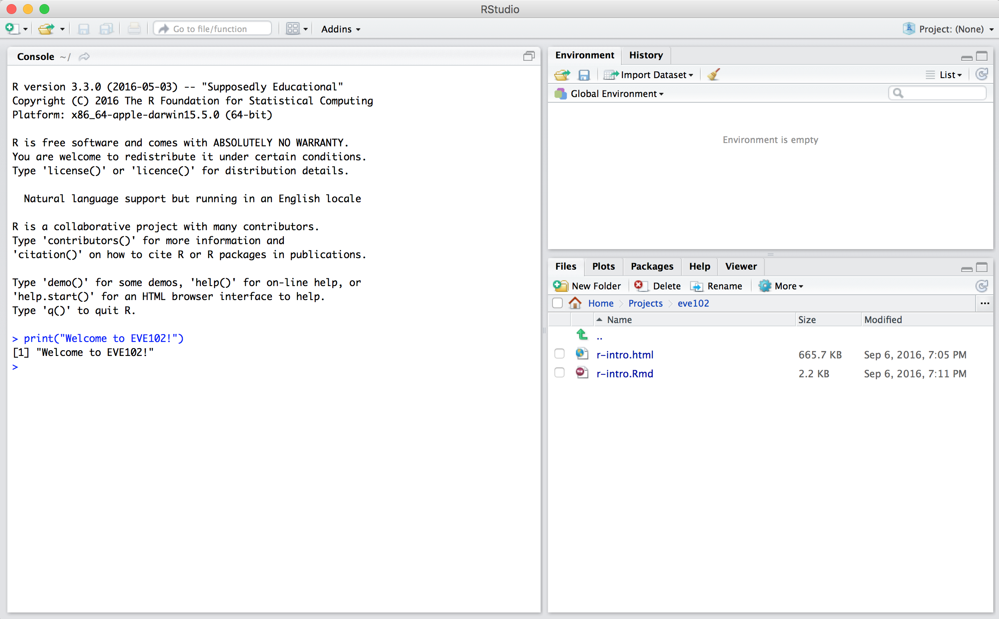

## EVE102 Package: R Course Materials for Population Genetics

|                    |                                                               |
|--------------------|---------------------------------------------------------------|
|**Lecture Time** | Monday, Wednesday, Friday 10am-10:50am | 
|**Location** | Olson Hall 158 |
|**Discussion Sections** | Tuesday 9am-9:50am/12:10pm-1pm, 2342 Storer Hall |
|**Instructor** | Graham Coop, 3342A Storer Hall, gmcoop [at] ucdavis [dot] edu |
|**Instructor Office Hour** | TBA, 3342A Storer Hall |
|**Teaching Assistant** | Erin Calfee, ecalfee [at] ucdavis [dot] edu |
|**TA Office Hour** | Wednesday 11am-11:50am, 2342 Storer Hall |

<br/>

This R package contains data, functions, and documentation for EVE102, Population
Genetics.

## Installing R and RStudio

To use the EVE102 R package, you will need to first download and install R 
and RStudio. If you already have up-to-date versions of R and RStudio, you 
may skip to the section 'Installing This R Package' below.

1. **Download R and Install R**. R is available from the "Comprehensive R
Archive Network" (CRAN): https://cran.cnr.berkeley.edu/. Download the version
for your operating system using this link. Install R by double clicking the
installer you've downloaded in the previous step and follow the instructions.
CRAN is also how you install packages that extend R's functionality (more on
this later).

2. **Download and install RStudio**. RStudio is a program that makes
interacting with and developing code in R *much* easier. Download RStudio
Desktop from their website:
https://www.rstudio.com/products/rstudio/download3/. Double click the RStudio
installer and follow the installation instructions.

Open RStudio and try entering:

```{R, eval=FALSE}
print("Welcome to EVE102!")
```

in the window labeled "Console". It should look something like this (but your
exact session will be different):




## Installing This R Package
To install this package, copy and paste the following into R:

```R
install.packages("devtools", dependencies=TRUE)
library(devtools)
install_github("cooplab/eve102", build_vignettes=TRUE)
```

Then, try the following:

```R
library(eve102)
tutorials()
```

which should open up a list of tutorials in your browser.

## Updating this Package

Throughout the course, we will make updates to this package and documentation.
You can always check if your `eve102` course package is up to date with:

```R
eve102_status()
```

If your package is out of date, update it with:

```R
eve102_update()
```

## Accessing the R Tutorials

The R tutorials for this course are contained in this package. These will open
the R tutorials in your default browser. To browse all tutorials, use:

```R
library(eve102)
tutorials()
```

Then, click the "HTML" link for the tutorial you wish to read.

Specific tutorials can be accessed by providing a tutorial number. For example,
to access the first tutorial, use:

```R
tutorials(1)
```

## Working with the EVE102 Datasets

This package contains all of the data you will need for the exercises in this
course. Since learning to load data into R is a valuable skill you should
learn, the data is stored in tab-separated value (TSV) files within the
package. Depending on your system (Mac, Windows, or Linux), this data may live
in different places, so to find the file path to the data, use the function
`eve102_data()`. Calling this function without arguments returns all datasets:

```R
> library(eve102)
> eve102_data()
  id                 file                                     description
1  1     CEU_10000.txt.gz             10,000 HapMap SNPs, CEU individuals
2  2 CEU_YRI_10000.txt.gz     10,000 HapMap SNPs, CEU and YRI individuals
3  3     YRI_10000.txt.gz             10,000 HapMap SNPs, YRI individuals
>
```

Then, you can get the file path for one of these files by calling the
`eve102_data()` function, providing the filename you wish to get the path to:

```R
> eve102_data("CEU_10000.txt.gz")
[1] "/usr/local/lib/R/3.3/site-library/eve102/extdata/CEU_10000.txt.gz"
```

This can then be used to load data in with R's `read.table()` function (since
this is in tab-separated value format).

```R
> d <- read.table(eve102_data("CEU_10000.txt.gz"), header=TRUE)
> head(d)
  chr           snp allele_A allele_a AA Aa aa  freq total
1   1 SNP_A-1909444        T        C 40 19  1 0.825    60
2   1 SNP_A-2237149        0        G  0  0 60 0.000    60
3   1 SNP_A-4303947        A        G 45 15  0 0.875    60
4   1 SNP_A-1886933        T        C  0 15 45 0.125    60
5   1 SNP_A-2236359        A        0 60  0  0 1.000    60
6   1 SNP_A-2205441        0        C  0  0 60 0.000    60
```
