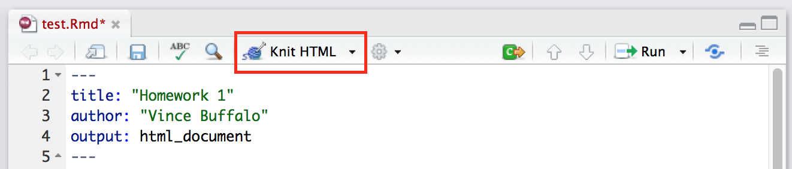
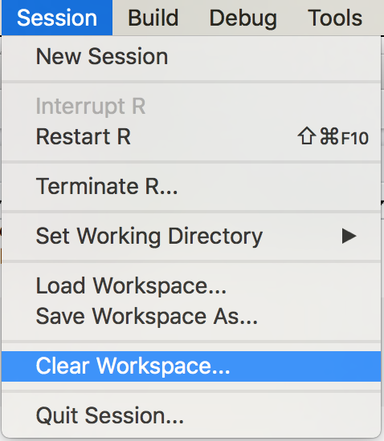

```{r setup, include=FALSE}
knitr::opts_chunk$set(prompt=FALSE, comment="", fig.width=6, fig.height=6)
```

R is a programming language designed for statistical computing. It allows you
to do incredibly powerful data manipulation, fit statistical models, and
visualize data. R has grown incredibly popular in recent years (e.g., see this
[New York Times
articles](http://www.nytimes.com/2009/01/07/technology/business-computing/07program.html?pagewanted=all&_r=0)
on R), and is the foundation of most of modern data science. We'll use R in
this course, and while at times it may be tricky (learning new programming
languages is *always* tricky), it's worth the effort as knowing R is a very
marketable skill. We'll cover the basics here, but other excellent references
are:

 - [R in a Nutshell](http://proquest.safaribooksonline.com/book/programming/r/9781449358204) by Joseph Alder. Available online through the UC Davis campus proxy.
 - [The Art of R Programming](http://heather.cs.ucdavis.edu/~matloff/132/NSPpart.pdf) by Norman Matloff (UC Davis computer science professor). 
 - [Advanced R](http://adv-r.had.co.nz) by Hadley Wickham. This is a great online resource (and now, [published book](https://www.amazon.com/dp/1466586966/ref=cm_sw_su_dp?tag=devtools-20)).


## Requirements

First, we need to install R, RStudio, and a few R packages. Follow these steps:

1. **Download R and Install R**. R is available from the "Comprehensive R
Archive Network" (CRAN): https://cran.cnr.berkeley.edu/. Download the version
for your operating system using this link. Install R by double clicking the
installer you've downloaded in the previous step and follow the instructions.
CRAN is also how you install packages that extend R's functionality (more on
this later).

2. **Download and install RStudio**. RStudio is a program that makes
interacting with and developing code in R *much* easier. Download RStudio
Desktop from their website:
https://www.rstudio.com/products/rstudio/download3/. Double click the RStudio
installer and follow the installation instructions.

Open RStudio and try entering:

```{R, eval=FALSE}
print("Welcome to EVE102!")
```

in the window labeled "Console". It should look something like this (but your
exact session will be different):


3. Next, we need to install a few R packages from CRAN. R packages are
contributed software that extends the functionality of R. We will first install
`devtools`, as this allows us to install the `eve102` course package from
GitHub (GitHub is a website for sharing code and collaboratively working on
projects). Then, we will load the `devtools` package with the `library()`
function, and then install the `eve102`:

```{R, eval=FALSE}
install.packages('devtools')
library(devtools)
install_github('vsbuffalo/eve102')
```

## Tracking Your Work: R Scripts and R Markdown

To turn in your R homework assignments, we would like you to use RMarkdown.
RMarkdown is simple format that allows you to intermix R code and text
explaining what you're doing. Here's how you do this:

1. In RStudio, go to File > New File > R Markdown. This will open a new window,
   containing an example RMarkdown file. At the top, change `title: "Untitled"`
   to your homework number and add an `author` section, like so:

    ```
    ---
    title: "EVE 102 Homework 1"
    author: "Vince Buffalo"
    output: html_document
    ---

    ```

    Be sure to leave the "r setup" code block that follows this in the example
RMarkdown file. You may wish to make the default image size larger by replacing
the contents of this code block with:


    ```
    knitr::opts_chunk$set(prompt=FALSE, comment="", fig.width=6, fig.height=6)
    ```

2. Then, press "knit HTML":




This will run all code, show the results and plots, and generate an HTML file.
This is how you should turn your homework in. You can use a raw R script too,
but we prefer an RMarkdown file, as it allows you to more easily describe what
you're doing. **You will need to rerun knitr HTML repeatedly throughout your
work to update the rendered HTML version of your homework.**

**Markdown:** Markdown is a very simple way of formatting text. You do not need
to know anything about it except (1) R code blocks and (2) sections. R code
blocks are what RStudio runs and prints the output of in your finalized
RMarkdown document. These are formatted as:


    ```{R}
    # your R code here
  
    ```

**RMarkdown cheatsheet:** If you're curious of other Markdown formatting
options like **bold** and *italics*, or just want need additional help with
RMarkdown, see the [RMarkdown
cheatsheet](https://www.rstudio.com/wp-content/uploads/2015/02/rmarkdown-cheatsheet.pdf).

**Workflow and keyboard shortcuts:** When you're working with R and RStudio,
it's easiest if you use the following workflow. Enter your code in the
RMarkdown file's R code block (as above) and press command + shift + enter
(Mac) or control + shift + enter (Windows) to run all code in that chunk. If
you want to run a single R code line, use command + enter (Mac) or control +
enter (Windows) with your cursor on the line you want to run. In either case,
the lines you sent to R and the output they created will be sent to the R
console window in RStudio (**these do not appear in your RMarkdown document
until you knit it**). 

Occasionally it's easiest to work directly in the R console window. Just
remember that any work done directly in the R console does not get saved unless
you include it in your RMarkdown file (and save that RMarkdown file!). Coding
takes lots of time: save your work often. Also, it's useful to knit your
RMarkdown file often, to make sure that no new code you've added breaks
anything. Furthermore, it's useful to clear your workspace (see the image
below) before knitting everything again, as this prevents any old objects in
your workspace from interfering with your code.




## R Basics I: Arithmetic 

To get acquainted with basic R, let's begin with some simple arithmetic
calculations. In this documentation, the gray box corresponds to what *you*
enter and the white box below the gray box is what R returns.  Do not enter the
`>` character --- this is just the R prompt.  For example, enter `3 + 4`:

```{R}
3 + 4  # add two numbers together
```

All the standard arithmetic operators work: `+` (addition), `-` (subtraction),
`*` (multiplication), `/` (division), and `^` (exponentiation). R uses the
standard PEMDAS (parenthesis, exponent, multiplication, division, addition, and
subtraction) order of operations. Note that we use a comment character `#` to
specify what we're doing. R ignores everything after the `#`; this is just to
help people understand your code. You don't have to narrate everything you're
doing (e.g. the comment in the above code is a bit unnecessary).

In general, use lots of parenthesis around statements to make your code
readable:

```{R}
2^((3 + 4)/2)
```

## R Basics II: Variables and Assignment

Often, we need to store some calculations for later use, or to break
computation across several lines. For example, if we know the frequency of an
allele in a population is 0.1, and we wish to calculate the genotype
frequencies expected under Hardy-Weinberg, it's easier to assign the frequency
of 0.1 in a variable, and then reference that variable in computations. In R,
we assign values using the operator `<-`. You can also use `=`, but following R
conventions, `<-` is preferable. Note that in RStudio, you can press option +
`-` (Mac) or alt + `-` (Windows) to make a `<-` (equivalent to entering a less
than and dash). For example, we assign the allele frequency to variable `p`
using:

```{R}
p <- 0.1
```

To view the value of a vector, just enter it alone on a line:

```{R}
p
```

Then, we can reference this variable in our calculations. For example, to
calculate the expected number of AA alleles under Hardy-Weinberg proportions,
we use:

```{R}
p^2
```

Similarly, for the heterozygote Aa, we'd use:

```{R}
2*p*(1-p)
```

Note, if you prefer to use `p` and `q` for the frequency of A and a, you could
assign `q` the value of `1-p`:

```{R}
q <- 1-p
2*p*q
```

## Data Structures I: Vectors

R is a *vectorized* language, meaning the operations we do are working on
*vectors* of numbers rather than single numbers (known as scalars). Don't worry
if this is confusing; we'll see what this means through a set of examples.

When we enter a number like `6` into R, it looks like we're just entering a
single number. However, R is really treating this like a *vector* of numbers
containing only one number: 6. We can prove this to ourselves by looking at the
length of the number 6:

```{R}
length(6)
```
try this with other numbers like `2.1`, `1e-9`, etc. (which uses scientific notation).

Numbers don't have lengths --- only vectors do. We make longer vectors by
concatenating other vectors together using the function `c()`. We'll discuss
functions in more depth later on, but for now, just note that we make vectors
like:

```{R}
genocounts <- c(5, 83, 412)
```

Here, we've assigned the vector `5, 83, 412` to a variable named
`genocounts`. We can then retrieve our vector's values:

```{R}
genocounts
```

### Indexing Vectors

We can retrieve individual values of a vector with brackets. For example, to
retrieve the first value, we use:

```{R}
genocounts[1]
```

and likewise for the second value (`genocounts[2]`), and third
(`genocounts[3]`). To get the last value, which has an index equal to the
length of the vector, we use:

```{R}
genocounts[length(genocounts)]
```
since `length(genocounts)` returns 3.

R also allows for *negative* indexes, which *excludes* certain values. For
example, if we wanted to have a vector containing the first and third elements
of `genocounts`, one way we could do this is to exclude the second element:

```{R}
genocounts[-2]
```

Similarly, we can index a vector by a vector containing the indexes. This is an
important concept in R, as it's the basis for subsetting dataframes. If we
wanted to return the first and third values (as above), we could create a
vector containing the indices `1, 3`, and then use this to subset the vector
`genocounts`. This looks like:

```{R}
genocounts[c(1, 3)]
```

## Data Structures II: Vector Data Types

Thus far, we haven't paid much attention to the type of data in R vectors.
Vectors in R come in five key types. I'll cover a few we may use in the course:

1. **Numeric**. This is the default, and what we've used thus far. These are called
   "floats" in other languages.

2. **Integer**. This are values without remainders, like 32. However, entering 32
   in R creates a numeric type (above), not an integer --- if you need to
   explicitly enter a vector, add an `L` after, e.g. `32L`.

3. **Logical**. Logical values are `TRUE` and `FALSE`. 

4. **Character**. Character values are created by using quotes around text,
   e.g. `"population genetics"` or `"Aa"`.

There are also special types for complex numbers and raw bytes, but we won't
use these in this course so won't cover them here.

### Type Coercion

One important rule of R vectors is that **elements in an R vector all have the
same type**. If you try to create a vector from objects with different types,
**R will coerce elements so they all have the same type**. Coercion follows a
set of rules, such that the least amount of information is lost. For example,
if we combine a vector containing a string with a vector containing a number,
everything is converted to a string:

```{R}
a <- c("character type", 512.123)
```

We can retrieve the type of a vector with the function `typeof()`:

```{R}
typeof(a)
```

**Implicit type coercion is a common source of problems for new R users, so
check vector types with `typeof()`**. For example, if you accidentally try to
concatenate a character vector with a numeric vector, everything becomes a
character vector. An example of this problem is:

```{R, error=TRUE}
a <- c(1, 4, 2)
b <- c("43")
d <- c(a, b)
sum(d)  # error
```

You can also coerce types with functions like `as.numeric()`, `as.integer()`,
`as.character()`, etc. To fix the error above, you'd want to coerce the vector
`b` to a numeric vector:

```{R}
b <- as.numeric(b)
d <- c(a, b)
sum(d)
```

## Functions I: Calling Functions

R has many, many mathematical functions that we'll use throughout the course.
They fall into two categories (1) mathematical functions, and (2) distribution
functions. Before delving into these, let's take a closer look at how calling
functions works.

Thus far, we've been calling functions like `length()` by just suppling a
single argument (e.g. `length(genocounts)`). Some functions require more than
one argument, or have optional arguments that change how they operate. For
example, a function we'll use is `sample()`. `sample()` takes a vector and
returns a random sample, with the size of the sample specified by the second
argument of `sample()`, `size`. For example (we enter `sample()` a few times to
see that it is indeed random):

```{R}
genotypes <- c("AA", "Aa", "aa")
sample(genotypes, 2)
sample(genotypes, 2)
sample(genotypes, 2)
```

Here, `genotypes` is the first argument, and provides the vector to sample. The
second argument is `size`, which is the number of elements of the supplied
vector to sample. To sample only one random element, we'd change 2 to 1:

```{R}
sample(genotypes, 1)
sample(genotypes, 1)
sample(genotypes, 1)
```

Note that entering a function name without parenthesis returns the function
code. This can be useful for seeing the arguments of a function (we'll see
another way to do this later):

```{R}
sample
```

Don't worry about the specifics here; just note the arguments on the first
line. These are: `x, size, replace = FALSE, prob = NULL`.

To take multiple samples (such that we're *resampling* the `genotypes` vector
multiple times), we need to *sample with replacement*. This allows the same
value to be sampled multiple times. We specify this by supplying the argument
`TRUE` to the third argument of `sample()`:

```{R}
sample(genotypes, 10, TRUE)
```

Alternatively, we can specify that `TRUE` is for the `replace` argument by
explicitly saying `replace=TRUE` when calling the function.

```{R}
sample(genotypes, 10, replace=TRUE)
```
which improves code readability.

By default, `sample()` samples the supplied vector (the first argument) such
that each element has uniform probability of being sampled. This can be changed
with an optional fourth argument, `prob`. For example, if we want to sample
`genotypes` using Hardy-Weinberg frequencies, we would specify these to the
`prob` parameter:

```{R}
p <- 0.1
hw <- c(p^2, 2*p*(1-p), (1-p)^2)
sample(genotypes, 20, replace=TRUE, prob=hw)
```
Note that the vector of `prob` must be equal in length to the vector to be
sampled (here `genotypes`), and in the same order.

### Getting Help! R Documentation

There are numerous R functions --- more than you should try to remember.
Programmers use documentation *constantly* in programming, so frequently that
learning to find what you need in a language's documentation is an
**essential** part of learning to programming. In R, we use the `help()`
function. Try entering `help(sample)` and reading through `sample()`'s
documentation.

Often we constantly have to refer to function documentation to see how a
function works, it's arguments, etc., R has a shortcut: just enter `?` and then
the function name, like `?sample`. 

Sometimes the best way to find out how to do something in R is to Google it.
[StackOverflow](http://stackoverflow.com/) has a wealth of great R questions
and answers, where expert programmers pose their solutions to different R
problems.

### Mathematical Functions

Below are some common mathematical functions we might use in the course:

1. `sum()`, sum all elements of a vector.

2. `mean()`, take a numeric average.

2. Logarithm functions: `log()` (logarithm base *e*), `log10()` (base 10), `log2()` (base 2).

3. `sqrt()`, square root.

4. `exp()`, exponentiation function e.g. *e<sup>x</sup>*.

5. `abs()`, absolute value.

6. `table()`, count the unique elements of a vector, or cross tabulate two
   vectors.

7. `seq()`, generate a sequence of numbers.

`table()` is useful: it allows us to tabulate the number of occurrences. For
example,  if use `sample()` to create a random sample of genotypes under
Hardy-Weinberg frequencies, we can calculate the numbers with:

```{R}
p <- 0.1
hw <- c(p^2, 2*p*(1-p), (1-p)^2)
rand_genotypes <- sample(genotypes, 200, replace=TRUE, prob=hw)
table(rand_genotypes)
```

`seq()` is extremely useful: it generates sequences of numbers. For example:

```{R}
seq(1, 20)
```

`seq()` also has a `by` argument, that allows you to create a sequence with
jumps:

```{R}
seq(1, 20, by=3)
```

## Data Structures III: Vectorized Arithmetic Operations

The big advantage with R's vectorization is that it simplifies doing things on
vectors of numbers, something we often have to do in statistical computing. For
example, if we try to add two vectors (`a` and `b`) together with `+`, R
**automatically applies `+` to each element**. This is **vectorization** and is
one reason R is such a powerful language. For example:

```{R}
a <- c(3, 1, 4)
b <- c(1, -4, 2)
a + b
```

Most of R's functions work this way, including `+`, `-`, `/`, `*`, `sqrt()`,
etc. If you've programmed in other languages before and have written loops,
note that we can avoid writing a loop here.

### Recycling

One gotcha with R's vectorization is that if one vector is shorter than the
other, the shorter vector is **reused during vectorization**. This is called
**recycling** and it's a source of frustration (and sometimes horrible errors)
among new R users. This is best illustrated through an example:

```{R}
a <- c(1, 20)
b <- c(1, 2, 3, 4)
a + b
```

Note how since `b` is longer than `a`, `a` is reused, giving us `1 + 1`, `2 +
20`, `3 + 1`, `4 + 20`. If the shorter vector is not a multiple of the longer
vector, R will warn us:

```{R}
a <- c(1, 2, 20)
b <- c(1, 2, 3, 4)
a + b
```

While recycling may seem mystical, it is useful. For example, we often need to
divide an entire vector by a single value. R recycles the divisor:

```{R}
b <- c(2, 3, 1, 4)
b/2
```

and similarly for multiplication:

```{R}
b <- c(2, 3, 1, 4)
2*b
```

Let's use what we've learned thus far for a simple population genetics example.
Suppose we randomly sample some genotypes using Hardy-Weinberg proportions:

```{R}
# repeating code from above
p <- 0.1
hw <- c(p^2, 2*p*(1-p), (1-p)^2)
rand_genotypes <- sample(genotypes, 200, replace=TRUE, prob=hw)
```

How might we calculate the genotype frequencies of this sample of genotypes? We
can get the raw counts with `table()`:

```{R}
rgtbl <- table(rand_genotypes)
rgtbl
```

and then divide the returned vector by the total number of genotypes (obtained
with `sum(rgtbl)`) to get the frequencies:

```{R}
rgtbl/sum(rgtbl)
```

Note what happened here: R **automatically** divided all elements of the vector
returned from `table()` by `sum(rgtbl)`, recycling this shorter vector.

## Functions II: Writing Simple Functions

In programming, we need to reuse code a lot. This is why R's functions exist:
it would be a nightmare to rewrite the code for `log()` or `sqrt()` each time
we needed to calculate the logarithm or square root of a number. We can also
write our own custom functions code that we can reuse, saving us from having to
copy and paste the same code multiple times (note that copying and pasting
during programming is [generally
bad](https://en.wikipedia.org/wiki/Copy_and_paste_programming)).

For example, through this tutorial, we've had to repeat our code to calculate
Hardy-Weinberg genotype frequencies from an allele frequency multiple times.
Let's solve this by writing a function that takes an allele frequency, and
returns a vector of the genotype frequencies:

```{R}
hw <- function(p) {
  props <- c(p^2, 2*p*(1-p), (1-p)^2)
  return(props)
}
```

Then, we can call our function as we do any other function:

```{R}
hw(0.3)
```

Do be aware of the fact that depending on how you write your functions, they
may not be vectorized. For example, if we had a vector of multiple  allele
frequencies, this version of the function wouldn't work the way we want it too:

```{R}
freqs <- c(0.01, 0.5, 0.2)
hw(freqs)
```

Note how this is wrong `c()` is concatenating everything, when we want genotype
frequencies *per* allele frequency, e.g. each row corresponds to the genotype
frequencies of one allele. This implies we need a 2D data structure like a
*matrix*. We can create a matrix with the `matrix()` function, but since we
want to turn the frequencies of AA, Aa, and aa into columns, an easier way is
to `cbind()` these together. `cbind()` takes vectors of the same length, and
binds them together by column (hence the "c" in `cbind()`); there is also
`rbind()` to bind by rows. To pretty output, we can specify column names like
AA, Aa, aa:

```{R}
hw2 <- function(p) {
  props <- cbind(AA=p^2, Aa=2*p*(1-p), aa=(1-p)^2)
  return(props)
}
freqs <- c(0.01, 0.5, 0.2)
gfreqs <- hw2(freqs)
gfreqs
```

This returns a matrix where columns are the frequencies of particular genotype
(e.g. AA, Aa, aa) across allele frequencies, and rows are genotype frequencies
across alleles. Specific entries of a matrix can be access with subsetting very
similar to subsetting a vector, except there are two indices: rows, and
columns. To access the Aa genotype frequency (second column) for the first row,
we use 

```{r}
gfreqs[1, 2]
```

similarly, for for the first row, third column:

```{r}
gfreqs[1, 3]
```

We can access an entire row by omitting the second index (but do keep comma).
For example, to access the second row:

```{R}
gfreqs[2, ]
```

Similarly, for columns, omit the first index (but do keep comma). To access the
entire second column:

```{r}
gfreqs[, 2]
```

Like vectors, matrices only store one data type (technically, R's matrices
*are* R's vectors, just with a dimension). 

## Data Structures II: DataFrames and Reading in Data

We often need to work with data of different types (e.g. character and
numeric), meaning that vectors and matrices won't work, since they can only
store data of one type. R's two dimensional data structure for data of
different types is the **dataframe**. You can create a dataframe by calling the
`data.frame()` function, providing the columns to make the dataframe from. For
example, if we wanted a dataframe containing the two alleles at a few loci, and
the frequency of the first allele, we could create it with something like the
following (note this data is made up):

```{R}
loci <- data.frame(allele_1 = c('A', 'T', 'T'),
                   allele_2 = c('C', 'A', 'G'),
                   freq = c(0.01, 0.3, 0.91))
loci
```

### Subsetting Dataframes 

We can access the columns of a dataframe just as we did with a matric, using
their position. For example, to access the third column:

```{R}
loci[, 3]
```

Similarly, we can can access specific rows this way too (e.g. to access the
third row, use `loci[3, ]`) and specific elements (e.g. to access the first
row, third column `loci[1, 3]`). Usually when working with dataframes, we just
need to access specific columns. While we could access columns by their their
position, it's easier (and makes code more readable) if we access them by their
column name. The easiest way to do this is to use the `$` operator, e.g.:

```{R}
loci$freq
```

Note that we can add columns to a dataframe this way too. For example, to add
the heterozygosity:

```{r}
loci$het <- 2*loci$freq*(1-loci$freq)
```

Study this carefully, as we'll use this a lot. It's often useful to append
columns containing calculations to your dataframe, as it stores everything
together.

### Loading Data into R

We often need to load data into R from an outside source. For this course, all
datasets are built into the `eve102` package. Since learning to load data into
R is a valuable skill you should learn, the data is stored in tab-separated
value (TSV) files within the package. Depending on your system (Mac, Windows,
or Linux), this data may live in different places, so to find the file path to
the data, use the function `eve102_data()`. Calling this function without
arguments returns all datasets:

```R
library(eve102)
eve102_data()
```

Then, you can get the file path for one of these files by calling the
`eve102_data()` function, providing the filename you wish to get the path to:

```R
eve102_data("CEU_10000.txt.gz")
```

This can then be used to load data in with R's `read.table()` function (since
this is in tab-separated value format).

```R
d <- read.table(eve102_data("CEU_10000.txt.gz"), header=TRUE)
```

By default, R turns all character vectors from a data file into *factors* when
loading data through `read.table()` (and sister functions like `read.csv()` for
CSV files). Factors are useful for statistical modeling, when character vectors
correspond to categorical or ordinal data like "yes", "no", or "high",
"medium", "low". Usually in this course, we don't want R to automatically
converting character vectors to factors, so we can pass the argument
`stringsAsFactors=FALSE` to `read.table()` (note: string is a computer science
term for character data):

```{r}
d <- read.table(eve102_data("CEU_10000.txt.gz"), header=TRUE,
                stringsAsFactors=FALSE)
```

## Simple Plotting

Finally, we cover some simple plotting functions. One of R's greatest strengths
is its ability to visualize data. We'll learn the basics of R's built in
graphics (known as *base graphics*), but if you continue to learn more R you
may want to learn about another graphics package known as
[ggplot2](http://ggplot2.org/).

### The `plot()` function

The simplest way to plot data is with the `plot()` function. `plot()` takes
care of creating a new plotting window, setting up the plot limits (the
dimensions of the x and y axes), and plotting points, lines, etc. We'll start
out with a simple introduction, and then add more complexity. Let's try a basic
scatter plot. We'll use the famous Iris dataset collected from Anderson (1935),
and discussed by Fisher (1936; the same Fisher that created much of early
population genetic, quantitative genetic, and statistical theory). This dataset
is built into R, and contains petal and sepal measurements for three species of
Irises. We can take a peak at it's contents with the `head()` function:

```{R}
head(iris)
```

Let's plot the sepal lengths (column `Sepal.Length`) on the x-axis and petal
lengths (column `Petal.Length`) on the y-axis. In its simplest form, `plot()`
takes a vector of x-coordinates and a vector of y-coordinates, like so:


```{R}
plot(iris$Sepal.Length, iris$Petal.Length)
```

We can adjust multiple aspects of this plot by providing additional arguments
to `plot()`. Here are some commonly used options:

 - `pch`: plotting character, which changes the character from the default of
an open circle. A commonly used alternative is `pch=19`, which is a closed circle.

 - `col`: color, which is the color to plot the points in. These can be
provided by name, e.g. "dark green" or a [hexadecimal
value](http://htmlcolorcodes.com/). See [this
document](http://www.stat.columbia.edu/~tzheng/files/Rcolor.pdf) for some R
color names.

 - `cex`: character expansion, which changes the size of the point plotted. 

 - `ylim`, `xlim`: the y-axis and x-axis plotting limits. These are useful for
plotting genotype and allele frequencies, which we know can only take values
between 0 and 1.

 - `ylab`, `xlab`: the y-axis and x-axis labels. Always label your axes!

Let's look at a quick example of these options in action, using the built in
data set we loaded above (you'll use for your homework). Let's plot the allele
frequencies (column `freq`) by the frequency of heterozygotes, which is the
`Aa` column of counts divided by the `total` column:

```{R}
d <- read.table(eve102_data("CEU_10000.txt.gz"), header=TRUE,
                stringsAsFactors=FALSE)
plot(d$freq, d$Aa/d$total)
```

This is a mediocre plot: it's not very pretty, axis labels aren't helpful, etc.
Let's clean it up a bit using the options discussed above:

```{R}
plot(d$freq, d$Aa/d$total, pch=19, cex=0.5, col="dark green",
     ylim=c(0, 1), xlim=c(0, 1), xlab="allele frequency",
     ylab="heterozygote frequency")
```

### Overlaying points and lines on top of plots

We can add additional features to our plot by calling other plotting functions.
We cannot do this with the `plot()` function, however, since this redraws
everything. Instead, we have to call the function `points()` (to add additional
points) or `lines()` to add a line. `points()` behaves identically to `plot()`,
so we won't discuss it much here. Here's one quick example of using `points()`
to add the genotype frequency of the AA allele:

```{R}
plot(d$freq, d$Aa/d$total, pch=19, cex=0.5, col="dark green",
     ylim=c(0, 1), xlim=c(0, 1), xlab="allele frequency",
     ylab="heterozygote frequency")
points(d$freq, d$AA/d$total, pch=19, cex=0.5, col="dark blue")
```

To use `lines()`, we pass the points to connect up with a line. To plot a
curve, we create a set of close points that when connected approximate the
exact curve. For example, let's plot the expected Hardy-Weinberg frequency of
the heterozygote genotype to our plot. First, we create a sequence of allele
frequencies from 0 to 1 using the `seq()` function, which takes a `from` and
`to` argument. We want this sequence to be finally spaced, so we specify that
we want 1,000 elements out, using the `length.out` argument:

```{R}
x <- seq(0, 1, length.out=1000)
head(x)  # take a look at what seq() returns
```

Then, we use `lines()` to plot these `x` values and the expected frequency of
heterozygotes under Hardy-Weinberg (I will redo entire plot for clarity, see
`lines()` at end). Note that to make the line thicker, I use `lwd=3` (line
width) and I specify the line type should be dashed with `lty=2`:

```{R}
plot(d$freq, d$Aa/d$total, pch=19, cex=0.5, col="dark green",
     ylim=c(0, 1), xlim=c(0, 1), xlab="allele frequency",
     ylab="heterozygote frequency")
lines(x, 2*x*(1-x), lty=2, lwd=3, col="purple")
```


